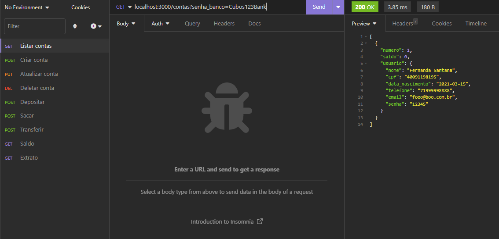
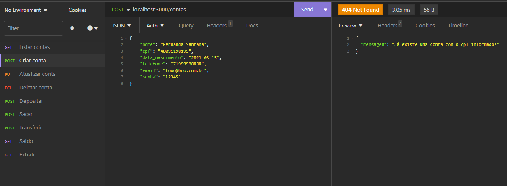

# API para um Banco Digital v1

O projeto trata sobre o gerenciamento de algumas funcionalidades de uma conta bancária de um banco digital. Criado no desafio M02 de backend da Cubos Academy.

## Funcionalidades do API

-   Cria conta bancária;
-   Lista contas bancárias;
-   Atualiza os dados do usuário da conta bancária;
-   Exclui uma conta bancária;
-   Depósita em uma conta bancária;
-   Saca de uma conta bancária;
-   Transfere valores entre contas bancárias;
-   Consulta saldo e extrato da conta bancária;


## 🛠 Tecnologias

As seguintes ferramentas foram usadas na construção do projeto:

     


## :computer: Comandos para rodar o projeto
```bash
git clone link
```

```bash
npm install
```
Obs.: É necessário ter o node.js e o insomnia instalado.
```bash
npm run start
```
O servidor inciará na porta:3000 - para isso acesse:
```bash
http://localhost:3000 ou o link do deploy
```

### Banco de dados
- Para o banco utilizei o ElephantSQL


## Endpoints

| Endpoints | rotas  |
|-----------|---------|
|Listar contas bancárias | `localhost:3000/contas?senha_banco=Cubos123Bank`|
|Criar conta bancária | `localhost:3000/contas`|
| Login | `localhost:3000/login` |
| Atualizar usuário da conta bancária |`/contas/:numeroConta/usuario` |
|Excluir Conta | `/contas/:numeroConta` |
| Depositar | `/transacoes/depositar`  |
| Sacar | `/transacoes/sacar` |
|Transferir | `/transacoes/transferir`|
| Saldo | `/contas/saldo?numero_conta=123&senha=123` |
| Extrato |`/contas/extrato?numero_conta=123&senha=123` |

#### Após incluir conta:


Se não incluir nenhuma conta será exibido um array vazio.

#### Exemplo de como criar a conta



### Link do deploy da aplicação
https://api-banco-digital-8eow.onrender.com/

###### tags: `back-end` `nodeJS` `API REST`
