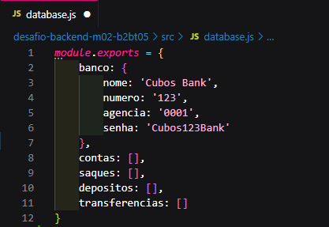

# API para um Banco Digital v1

O projeto trata sobre o gerenciamento de algumas funcionalidades de uma conta bancária de um banco digital. Criado no desafio M02 de backend da Cubos Academy.

## Funcionalidades do API

-   Cria conta bancária;
-   Lista contas bancárias;
-   Atualiza os dados do usuário da conta bancária;
-   Exclui uma conta bancária;
-   Depósita em uma conta bancária;
-   Saca de uma conta bancária;
-   Transfere valores entre contas bancárias;
-   Consulta saldo e extrato da conta bancária;


## 🛠 Tecnologias

As seguintes ferramentas foram usadas na construção do projeto:

     

## :computer: Comandos para rodar o projeto
```bash
git clone link
```

```bash
npm install
```
Obs.: É necessário ter o node.js e o insomnia instalado.
```bash
npm run start
```
O servidor inciará na porta:3000 - para isso acesse:
```bash
http://localhost:3000
```

### Banco de dados


## Endpoints

### Listar contas bancárias

#### rota `localhost:3000/contas?senha_banco=Cubos123Bank`
    - lista todas as contas bancárias existentes.

- **Condição**:

    -   Informar a senha correta;

#### Após incluir conta:


Se não incluir nenhuma conta será exibido um array vazio.

### Criar conta bancária

#### rota `localhost:3000/contas`

Esse endpoint cria uma conta bancária.

#### Exemplo de como criar a conta


### Atualizar usuário da conta bancária

#### rota `/contas/:numeroConta/usuario`

Esse endpoint atualiza apenas os dados do usuário de uma conta bancária.


### Excluir Conta

#### rota `/contas/:numeroConta`

Esse endpoint exclui uma conta bancária existente.

### Depositar

#### rota `/transacoes/depositar`

Esse endpoint faz o depósito em uma conta bancária existente.

### Sacar

#### rota `/transacoes/sacar`

Esse endpoint realiza o saque de um valor da conta bancária informada e registra essa transação.

### Transferir

#### rota `/transacoes/transferir`

Esse endpoint permite a transferência de dinheiro de uma conta bancária para outra e registra essa transação.

### Saldo

#### `GET` `/contas/saldo?numero_conta=123&senha=123`

Esse endpoint retorna o saldo de uma conta bancária.

### Extrato

#### `GET` `/contas/extrato?numero_conta=123&senha=123`

Esse endpoint lista as transações realizadas de uma conta específica.

###### tags: `back-end` `nodeJS` `API REST`
